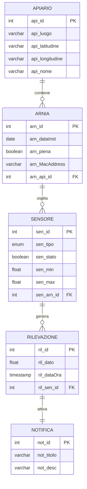

# Documento dei Requisiti — Apicoltura Digitale

**Progetto:** Sistema IoT per il monitoraggio remoto delle arnie
**Anno Scolastico:** 2025/2026
**Versione:** 1.0
**Data:** 15/01/2026

---

## Indice

1. [Introduzione](#1-introduzione)
2. [Glossario](#2-glossario)
3. [Stakeholder](#3-stakeholder)
4. [Requisiti Utente](#4-requisiti-utente)
5. [Requisiti di Sistema](#5-requisiti-di-sistema)
   - [5.1 Database (Gruppo A)](#51-gruppo-a--database)
   - [5.2 Hardware (Gruppo B)](#52-gruppo-b--hardware-sensori)
   - [5.3 Firmware (Gruppo C)](#53-gruppo-c--firmware-e-comunicazione-rest)
   - [5.4 Rete (Gruppo D)](#54-gruppo-d--architettura-di-rete)
6. [Casi d'Uso](#6-casi-duso)
7. [Requisiti Non Funzionali](#7-requisiti-non-funzionali)
8. [Gestione Errori e Alert](#8-gestione-errori-e-alert)
9. [Tracciabilità](#9-tracciabilità)
10. [Indice dei Documenti](#10-indice-dei-documenti)

---

## 1. Introduzione

### 1.1 Scopo del Documento

Questo documento definisce i requisiti completi per il sistema **Apicoltura Digitale**, un progetto IoT sviluppato come project work per le classi quinte di Informatica. L'obiettivo è trasformare le esigenze dell'apicoltore in specifiche chiare, verificabili e tracciabili.

### 1.2 Contesto del Progetto

Il sistema raccoglie dati ambientali e operativi dalle arnie tramite dispositivi ESP32-CAM equipaggiati con sensori, trasmette i dati via REST API a un database cloud, e fornisce un'interfaccia web mobile per la consultazione.

**Componenti principali:**
- Dispositivo IoT (ESP32-CAM + sensori)
- Router 4G LTE (Strong 300 Mini)
- Server REST (PHP)
- Database MySQL (restdb.io)
- Web app mobile

### 1.3 Documenti di Riferimento

| Documento | Percorso |
|-----------|----------|
| Guida Requisiti | [Come scrivere i requisiti.md](./Come%20scrivere%20i%20requisiti.md) |
| Guida Git | [docs/Guida_pratica_a_Git.pdf](./docs/Guida_pratica_a_Git.pdf) |
| Documentazione Firmware | [docs/DOCUMENTAZIONE.md](./docs/DOCUMENTAZIONE.md) |
| Manuale Router | [docs/Manuale.md](./docs/Manuale.md) |

---

## 2. Glossario

| Termine | Definizione |
|---------|-------------|
| **Apiario** | Insieme di arnie collocate in una specifica posizione geografica |
| **Arnia** | Struttura artificiale che ospita una colonia di api |
| **Alveare** | Nido naturale delle api (termine spesso usato come sinonimo di arnia) |
| **Melario** | Parte superiore dell'arnia dove le api depositano il miele in eccesso |
| **Nido** | Parte centrale dell'arnia dove la regina depone le uova e si sviluppa la covata |
| **Covata** | Insieme di uova, larve e pupe presenti nel nido |
| **Glomere** | Ammasso sferico di api che si forma in inverno per mantenere il calore |
| **Sciamatura** | Processo naturale di riproduzione della colonia: metà delle api lascia l'arnia con la vecchia regina |
| **Propoli** | Resina raccolta dalle api usata per sigillare fessure e sterilizzare superfici |
| **Predellino** | Piattaforma di atterraggio all'ingresso dell'arnia |
| **Varroa** | Acaro parassita delle api, principale minaccia per le colonie |
| **Deep Sleep** | Modalità a basso consumo del microcontrollore ESP32 |
| **Timestamp** | Marca temporale associata a ogni misurazione (data e ora) |

---

## 3. Stakeholder

| Stakeholder | Ruolo | Interesse |
|-------------|-------|-----------|
| **Apicoltore** | Utente principale | Monitorare lo stato delle arnie da remoto, ricevere alert, ridurre visite fisiche |
| **Amministratore** | Gestore sistema | Configurare utenti, gestire parametri, manutenzione software |
| **Docenti** | Supervisori progetto | Valutare il lavoro, verificare requisiti didattici |
| **Team Sviluppo** | Realizzatori | Implementare il sistema secondo le specifiche |
| **Manutentore** | Tecnico | Installare, riparare e aggiornare l'hardware sul campo |

---

## 4. Requisiti Utente

### RU-01 — Monitoraggio Remoto
L'apicoltore vuole vedere sul telefono i dati delle sue arnie senza doversi recare fisicamente sul posto.

### RU-02 — Allarmi Tempestivi
L'apicoltore vuole ricevere una notifica se qualcosa non va (temperatura troppo alta/bassa, peso anomalo, sciamatura imminente).

### RU-03 — Storico Dati
L'apicoltore vuole consultare lo storico delle misurazioni per confrontare periodi diversi e capire l'andamento della produzione.

### RU-04 — Autonomia Energetica
Il sistema deve funzionare in zone isolate senza rete elettrica, alimentato da pannello solare e batteria.

### RU-05 — Facilità d'Uso
L'interfaccia deve essere semplice e consultabile da smartphone senza competenze tecniche.

### RU-06 — Affidabilità
Il sistema deve continuare a raccogliere dati anche quando la connessione internet è temporaneamente assente.

---

## 5. Requisiti di Sistema

### 5.1 Gruppo A — Database

> **Documentazione correlata:**
> - Schema ER: [schemi logici e er/schema er 2.0-2026-01-15-084527.mmd](./schemi%20logici%20e%20er/schema%20er%202.0-2026-01-15-084527.mmd)
> - Schema Logico: [schemi logici e er/schema logico 2.0-2026-01-15-084557.mmd](./schemi%20logici%20e%20er/schema%20logico%202.0-2026-01-15-084557.mmd)
> - Regole Lettura/Scrittura: [schemi logici e er/read write BS.jpg](./schemi%20logici%20e%20er/read%20write%20BS.jpg)
> - Business Rules: [schemi logici e er/BS.jpg](./schemi%20logici%20e%20er/BS.jpg)
> - Regole Lettura: [schemi logici e er/regole lettura BS.jpg](./schemi%20logici%20e%20er/regole%20lettura%20BS.jpg)

#### Requisiti Funzionali

**RF-DB-01 — Anagrafiche**

Il database deve gestire le seguenti entità:

| Entità | Attributi | Relazioni |
|--------|-----------|-----------|
| **Apiario** | id, nome, luogo, latitudine, longitudine | Contiene → Arnia |
| **Arnia** | id, dataInstallazione, piena, MacAddress | Appartiene a → Apiario, Ospita → Sensore |
| **Sensore** | id, tipo, stato, min, max | Appartiene a → Arnia, Genera → Rilevazione |
| **Rilevazione** | id, dato, dataOra | Generata da → Sensore, Attiva → Notifica |
| **Notifica** | id, titolo, descrizione | Attivata da → Rilevazione |

> **Esempi JSON:**
> - Apiari: [EsempiJSON/JSONApiari.json](./EsempiJSON/JSONApiari.json)
> - Rilevazioni: [EsempiJSON/JSONRilevazioni.json](./EsempiJSON/JSONRilevazioni.json)
> - Arnie: [EsempiJSON/arnie.json](./EsempiJSON/arnie.json)
> - Sensori: [EsempiJSON/sensori.json](./EsempiJSON/sensori.json)
> - Notifiche: [EsempiJSON/notifiche.json](./EsempiJSON/notifiche.json)
> - Utenti: [EsempiJSON/utenti.json](./EsempiJSON/utenti.json)
> - Tipi: [EsempiJSON/tipi.json](./EsempiJSON/tipi.json)

**RF-DB-02 — Tipi Utente**

| Tipo | Permessi Lettura | Permessi Scrittura |
|------|------------------|-------------------|
| **Admin** | Tutte le entità | Apiari, Arnie, Sensori (solo soglie), Gestione utenti |
| **Apicoltore** | Tutte le entità | Apiari, Arnie, Sensori (solo soglie) |

**RF-DB-03 — Tipi di Dati**

Il database deve memorizzare:
- **Rumore (dB):** Livello sonoro per rilevare anomalie, predatori, sciami
- **Peso (kg):** Indicatore di produzione miele e salute colonia
- **Temperatura (°C):** Monitoraggio termoregolazione (nido ~35°C)
- **Umidità (%):** Cruciale per maturazione miele (< 65% RH)
- **Livello acqua (%):** Disponibilità idrica per termoregolazione

**RF-DB-04 — Filtri e Statistiche**
Il sistema deve permettere filtri temporali e calcolo statistiche (medie, trend).

**RF-DB-05 — Gestione Multi-Apiario**
Un utente può gestire più apiari in posizioni diverse.

**RF-DB-06 — Gestione Multi-Arnia**
Ogni apiario può contenere più arnie, ciascuna monitorata indipendentemente.

---

### 5.2 Gruppo B — Hardware Sensori

> **Documentazione correlata:**
> - [docs/DOCUMENTAZIONE HARDWARE.md](./docs/DOCUMENTAZIONE%20HARDWARE.md)
> - Materiali e BOM: [Schemi di rete e BOM/DocumentazioneProdotti.md](./Schemi%20di%20rete%20e%20BOM/DocumentazioneProdotti.md)
> - Documentazione Materiali: [Schemi di rete e BOM/Documentazione apicoltura materiali.pdf](./Schemi%20di%20rete%20e%20BOM/Documentazione%20apicoltura%20materiali.pdf)

#### RF-HW-01 — Monitoraggio Peso (HX711 + Cella di Carico)

> **Documentazione tecnica:** [src/Codice di test per SENSORI/Sensore_HX711/Documento Sensore HX711.md](./src/Codice%20di%20test%20per%20SENSORI/Sensore_HX711/Documento%20Sensore%20HX711.md)

**Descrizione:** Il device misura il peso totale dell'arnia con risoluzione minima di 100g e calcola il guadagno netto giornaliero (mielometro).

**Nota dominio:** Il peso cresce con nettare e colonia, diminuisce quando la colonia consuma miele o muore.

**Specifiche tecniche:**
- ADC: 24 bit
- Range: 0-80 kg
- Alimentazione: 2,6V - 5,5V
- Frequenza dati: 10Hz o 80Hz

**Casi d'Uso (Sensore HX711):**

| Stato dell'Arnia | Cosa rileva il sensore | Comunicazione al Server |
|------------------|------------------------|-------------------------|
| **Produzione di Miele** | Aumento costante del peso durante il giorno (fino a diversi kg durante le grandi fioriture) | Report "Raccolto Attivo" - le api stanno portando nettare |
| **Smielatura Necessaria** | Peso totale raggiunge soglia predefinita (es. +20kg rispetto al peso base) | Notifica "Smielatura Necessaria" - momento di raccogliere il miele |
| **Consumo Scorte Invernale** | Diminuzione lenta ma costante (poche decine di grammi/giorno) durante i mesi freddi | "Monitoraggio Scorte" - calcolo nutrimento rimasto |
| **Emergenza Fame** | Peso sceso sotto soglia critica (peso arnia vuota + minimo vitale) | **ALLARME CRITICO** "Scorte Esaurite" - intervento immediato richiesto |
| **Sciamatura Avvenuta** | Calo improvviso e massiccio (1-3 kg) in pochi minuti durante ore diurne | **AVVISO IMMEDIATO** - parte della famiglia ha lasciato l'arnia |
| **Furto o Ribaltamento** | Variazione istantanea verso zero o valore instabile | **ALLARME SICUREZZA** "Manomissione Arnia" |
| **Diagnostica Sensore** | Segnali fuori scala o assenza dati seriali | "Errore Sensore" - guasto cella o problema connessione |

---

#### RF-HW-02 — Clima Interno (SHT21/HTU21D)

> **Documentazione tecnica:** [src/Codice di test per SENSORI/Sensore_SHT21/Documentazione Sensore SHT21.md](./src/Codice%20di%20test%20per%20SENSORI/Sensore_SHT21/Documentazione%20Sensore%20SHT21.md)

**Descrizione:** Misura Temperatura e Umidità Relativa (RH) nella zona superiore (melario) e/o centrale (nido).

**Nota dominio:** L'umidità interna > 65% indica rischio fermentazione. La temperatura del nido deve rimanere stabile a ~35°C per la covata.

**Specifiche tecniche:**
- Interfaccia: I2C
- Range umidità: 0-100% RH (risoluzione 0,04% a 12 bit)
- Range temperatura: -40°C a +125°C (risoluzione 0,01°C a 14 bit)
- Accuratezza: ±2% RH, ±0,3°C

**Casi d'Uso (Sensore HTU21D - Umidità):**

| Caso d'Uso | Valore Umidità | Tipo Invio | Messaggio/Azione |
|------------|----------------|------------|------------------|
| **Mantenimento Storico** | 55-70% (standard) | Dato Silenzioso | Nessun disturbo, salvataggio per grafici |
| **Maturazione Miele** | Discesa graduale < 60% | Notifica | Il miele sta raggiungendo la giusta densità |
| **Inizio Sciamatura** | Salita improvvisa > 85% | **ALLARME** | Picco anomalo! Possibile sciame in movimento |
| **Condensa Invernale** | Costante > 90% per ore | Notifica | Rischio gocciolamento sulle api |
| **Blocco Sensore** | Valore bloccato (es. 99% fisso) | Notifica | Manutenzione: probabile propoli sulla membrana |
| **Allagamento/Intrusione** | Salita istantanea al 100% | **ALLARME** | CRITICO: verifica integrità arnia |

---

#### RF-HW-03 — Temperatura Interna (DS18B20)

> **Documentazione tecnica:** [src/Codice di test per SENSORI/Sensore_DS18B20/Documentazione Sensore DS18B20.md](./src/Codice%20di%20test%20per%20SENSORI/Sensore_DS18B20/Documentazione%20Sensore%20DS18B20.md)
> **Flowchart:** [Flowcharts/Flowchart Temperatura 1.0.mmd](./Flowcharts/Flowchart%20Temperatura%201.0.mmd)

**Descrizione:** Misura la temperatura interna dell'arnia con sonda impermeabile.

**Specifiche tecniche:**
- Interfaccia: 1-Wire
- Range: -55°C a +125°C
- Accuratezza: ±0,5°C (tra -10°C e +85°C)
- Risoluzione: 9-12 bit configurabile
- Sonda: acciaio inossidabile, impermeabile

**Casi d'Uso (Sensore DS18B20 - Temperatura):**

| Livello | Caso d'Uso | Rilevazione | Comunicazione Server |
|---------|------------|-------------|---------------------|
| **Semplice** | Monitoraggio Covata Attiva | Temperatura costante 34-36°C | POST Stato: regina sta deponendo, covata riscaldata correttamente |
| **Semplice** | Controllo Invernale (Glomere) | Temperature 15-25°C nei mesi freddi | POST Dato: colonia viva, produce calore per sopravvivere |
| **Medio** | Allarme Ipotermia | Temperatura < 10°C nonostante glomere | POST **Allarme**: "Pericolo freddo! Famiglia piccola o senza scorte" |
| **Medio** | Pre-Sciamatura | Innalzamento improvviso > 37°C | POST **Alert**: "Possibile sciamatura imminente" |
| **Estremo** | Rischio Collasso Favi | Temperature 40-42°C | POST **Allarme**: "Emergenza! Cera rischia di sciogliersi" |
| **Estremo** | Morte della Colonia | Temperatura interna = esterna per >24h | POST **Alert**: "Probabile perdita famiglia: assenza termoregolazione" |

---

#### RF-HW-04 — Analisi Acustica (KY-038/INMP441)

> **Documentazione tecnica:** [src/Codice di test per SENSORI/Sensore_KY-038/Documentazione Sensore KY-038.md](./src/Codice%20di%20test%20per%20SENSORI/Sensore_KY-038/Documentazione%20Sensore%20KY-038.md)

**Descrizione:** Campiona il rumore interno ed effettua analisi in frequenza (FFT) per identificare picchi specifici tra 200Hz e 600Hz.

**Nota dominio:** Le api emettono frequenze specifiche per stati diversi:
- "Piping" (regine vergini pre-sciamatura): 400-500Hz
- Orfanità: bassa frequenza, "lamento"
- Ventilazione notturna: asciugatura miele

**Specifiche tecniche:**
- Tensione operativa: 3,3V - 5,5V
- Chip comparatore: LM393
- Microfono: Condensatore Elettret Omnidirezionale
- Uscita: Analogica (segnale audio grezzo)

**Casi d'Uso (Sensore KY-038 - Audio):**

| Intensità | Stato Arnia | Soglia Sonora | Comunicazione Server |
|-----------|-------------|---------------|---------------------|
| **Silenzio/Minimo** | Inattività/Glomere | 100-180 Hz | "Quiescenza" - api in glomere o riposo profondo |
| **Basso/Moderato** | Attività di Routine | 190-250 Hz | "Stato Normale" - ronzio tipico colonia sana |
| **Medio/Costante** | Ventilazione/Raccolto | 250-350 Hz | "Forte Attività" - deumidificazione nettare o raffreddamento |
| **Elevato/Persistente** | Pre-Sciamatura | 350-550 Hz | **AVVISO** - ronzio collettivo che precede uscita sciame |
| **Picco Improvviso** | Urto/Aggressione | >1000 Hz | **ALLARME SICUREZZA** - impatto, caduta o manomissione |
| **Alto/Irregolare** | Stato Difesa/Attacco | 600-800 Hz | **ALLARME CRITICO** - agitazione da predatori o disturbi |
| **Assente** | Anomalia/Morte | 0-50 Hz | **ALLARME** - guasto sensore o perdita colonia |

---

#### RF-HW-05 — Livello Risorse Idriche (HW-038)

**Descrizione:** Misura la distanza del pelo libero dell'acqua in un serbatoio esterno e converte in percentuale residua.

**Nota dominio:** Le api necessitano di molta acqua per termoregolare l'arnia d'estate. Se l'acqua finisce, la colonia rischia il collasso termico.

**Casi d'Uso (Sensore HW-038 - Livello Acqua):**

| Stato Secchio | Valore Sensore | Tipo Invio | Messaggio |
|---------------|----------------|------------|-----------|
| **Pieno/OK** | Conducibilità presente | Dato Silenzioso | Livello acqua sufficiente |
| **Sotto Soglia** | Resistenza infinita (asciutto) | Notifica | "L'acqua è finita. Riempire il secchio" |
| **Inizio Evaporazione** | Valore analogico variabile | Dato Silenzioso | Trend: acqua in calo (monitoraggio consumi) |
| **Sensore Ossidato** | Valore instabile/fisso | Dato Silenzioso | Manutenzione: pulire elettrodi |

---

#### RF-HW-06 — Monitoraggio Visivo (ESP32-CAM)

> **Documentazione tecnica:** [src/Codice di test per SENSORI/Esp32 Cam/Documentazione Esp32 Cam.md](./src/Codice%20di%20test%20per%20SENSORI/Esp32%20Cam/Documentazione%20Esp32%20Cam.md)

**Descrizione:** Scatta fotografie del predellino di volo a intervalli regolari o su richiesta.

**Nota dominio:** Osservare l'ingresso permette di capire la salute della famiglia senza aprire l'arnia:
- "Barba" delle api: troppo caldo o arnia piena
- Polline: colori indicano cosa stanno raccogliendo
- Predatori: calabroni o vespe che attaccano

**Casi d'Uso (ESP32-CAM):**

| Caso d'Uso | Azione | Destinatario | Messaggio |
|------------|--------|--------------|-----------|
| **Ispezione Visiva** | Scatta foto su richiesta da app | Proprietario | Foto mostrata nell'interfaccia |
| **Diario di Volo** | Foto automatica ogni 15-30 min | Server | Foto salvata in galleria storica |
| **Stato Batteria** | Controlla tensione ESP32-CAM | Server | Info periodica su carica pannello solare |

---

### 5.3 Gruppo C — Firmware e Comunicazione REST

> **Documentazione correlata:**
> - [docs/DOCUMENTAZIONE.md](./docs/DOCUMENTAZIONE.md)
> - Lista Errori: [docs/Lista Errori e Alert.md](./docs/Lista%20Errori%20e%20Alert.md)
> - Flowchart Peso: [Flowcharts/Flowchart peso 2.0.mmd](./Flowcharts/Flowchart%20peso%202.0.mmd)
> - Flowchart Temperatura: [Flowcharts/Flowchart Temperatura 1.0.mmd](./Flowcharts/Flowchart%20Temperatura%201.0.mmd)
> - Flowchart Umidità: [Flowcharts/Flowchart Umidità 1.0.mmd](./Flowcharts/Flowchart%20Umidità%201.0.mmd)
> - Codice ESP: [src/esp/](./src/esp/)
> - Validation Library: [src/esp/SensorValidation.h](./src/esp/SensorValidation.h)

#### Requisiti Funzionali — Temperatura (DS18B20)

| ID | Requisito | Descrizione |
|----|-----------|-------------|
| RF-SW-01 | TM, Temperatura Interna | Il sensore misura la temperatura interna dell'arnia |
| RF-SW-02 | TM, Unità di Misura | Misura in gradi Celsius (°C) |
| RF-SW-03 | TM, Tipo di Dato | Valore float |
| RF-SW-04 | TM, Timestamp | Data e ora associata a ogni misurazione |
| RF-SW-05 | TM, Alert Soglia Massima | Alert al superamento di 37°C (configurabile da DB) |
| RF-SW-06 | TM, Alert Soglia Minima | Alert sotto 30°C (configurabile da DB) |
| RF-SW-07 | TM, Frequenza Aggiornamento | Misurazione ogni 6 minuti |

#### Requisiti Funzionali — Peso (HX711)

| ID | Requisito | Descrizione |
|----|-----------|-------------|
| RF-SW-08 | PS, Misurazione | Segnale analogico convertito in valore digitale 24 bit |
| RF-SW-09 | PS, Taratura | Funzione di taratura per differenza pesi |
| RF-SW-10 | PS, Trasforma dato grezzo | Conversione valore grezzo in kg |
| RF-SW-11 | PS, Power Management | Deep sleep disattivato ogni 3 ore |
| RF-SW-12 | PS, Gestione Data | Data associata a ogni misurazione |
| RF-SW-13 | PS, Gestione Ora | Orario associato a ogni misurazione |

> **Flowchart processo peso:** [Flowcharts/Flowchart peso 2.0.mmd](./Flowcharts/Flowchart%20peso%202.0.mmd)

#### Requisiti Funzionali — Microfono (KY-038)

| ID | Requisito | Descrizione |
|----|-----------|-------------|
| RF-SW-14 | MIC, Acquisizione | Acquisizione segnale ogni 10 secondi |
| RF-SW-16 | MIC, Frequenza | Calcolo frequenza per stato sciame |
| RF-SW-17 | MIC, Verifica Soglia | Confronto con valori allarme da DB |
| RF-SW-18 | MIC, Notifica Alert | Notifica apicoltore se supera soglia |
| RF-SW-18.5 | MIC, Timestamp | 6 misurazioni accumulate, invio con timestamp |

#### Requisiti Funzionali — Umidità (SHT21)

| ID | Requisito | Descrizione |
|----|-----------|-------------|
| RF-SW-19 | UM, Misurazione | Percentuale umidità nell'aria |
| RF-SW-20 | UM, Tipo di Dato | Valore float |
| RF-SW-21 | UM, Timestamp | Data e ora associata |
| RF-SW-22 | UM, Alert Soglia Massima | Alert oltre 70% (configurabile da DB) |
| RF-SW-23 | UM, Alert Soglia Minima | Alert sotto 40% (configurabile da DB) |
| RF-SW-24 | UM, Frequenza Aggiornamento | Misurazione ogni 6 minuti |

> **Flowchart processo umidità:** [Flowcharts/Flowchart Umidità 1.0.mmd](./Flowcharts/Flowchart%20Umidità%201.0.mmd)

#### Requisiti Funzionali — Sensore Acqua (HW-038)

| ID | Requisito | Descrizione |
|----|-----------|-------------|
| RF-SW-25 | SA, Misurazione | Livello acqua in percentuale |
| RF-SW-26 | SA, Tipo di Dato | Valore float |
| RF-SW-27 | SA, Timestamp | Data e ora associata |
| RF-SW-28 | SA, Alert Soglia Massima | Alert al superamento soglia massima |
| RF-SW-29 | SA, Alert Soglia Minima | Alert sotto 5% |
| RF-SW-30 | SA, Frequenza Aggiornamento | Misurazione ogni 40 minuti |
| RF-SW-31 | SA, Taratura | Salvataggio livello min/max durante riempimento |

#### Requisiti Funzionali — Telecamera (ESP32-CAM)

| ID | Requisito | Descrizione |
|----|-----------|-------------|
| RF-SW-32 | TC, Registrazione | Video inviati al database ogni minuto |
| RF-SW-33 | TC, Attivazione Manuale | Attivazione da applicazione |
| RF-SW-34 | TC, Attivazione Automatica | Attivazione quando luminosità > 20% |
| RF-SW-35 | TC, Timestamp | Data e ora di registrazione |

#### Requisiti Funzionali — Comunicazione e Sistema

| ID | Requisito | Descrizione |
|----|-----------|-------------|
| RF-SW-36 | Funzione di Lettura | Taratura manuale e lettura parametri da DB |
| RF-SW-37 | Funzione di Scrittura | Funzione `inviaDatiAlServer()` per invio dati |
| RF-SW-38 | Struttura JSON | Formato messaggio definito (es. `{"temp": 32.5, "peso": 45.2}`) |
| RF-SW-39 | Gestione DeepSleep | Risparmio energetico senza spegnere Wi-Fi durante invio |
| RF-SW-40 | Documentazione | Documento che spiega l'intero progetto |
| RF-SW-41 | Tabella dei Pin | Documentazione pin aggiornata continuamente |
| RF-SW-42 | Registro Requisiti | Aggiornamento continuo del registro |
| RF-SW-43 | Informazioni Codice | Commenti approfonditi nel codice |

---

### 5.4 Gruppo D — Architettura di Rete

> **Documentazione correlata:**
> - Standard di rete: [Schemi di rete e BOM/documentazine Standard di rete.md](./Schemi%20di%20rete%20e%20BOM/documentazine%20Standard%20di%20rete.md)
> - Documentazione Router: [Schemi di rete e BOM/Documentazione_Router.md](./Schemi%20di%20rete%20e%20BOM/Documentazione_Router.md)
> - Manuale Configurazione: [docs/Manuale.md](./docs/Manuale.md)
> - Lista Materiali: [Schemi di rete e BOM/DocumentazioneProdotti.md](./Schemi%20di%20rete%20e%20BOM/DocumentazioneProdotti.md)

#### Requisiti Funzionali

| ID | Requisito | Descrizione |
|----|-----------|-------------|
| RF-NET-01 | Router Dedicato | Router LTE con SIM in box IP67/IP68 |
| RF-NET-02 | Scelta Gestore | Selezione basata su copertura reale, test sul campo |
| RF-NET-03 | Trasmissione Automatica | Dati trasmessi senza intervento manuale |
| RF-NET-04 | Ridotta Manutenzione | Minimo intervento ordinario richiesto |
| RF-NET-05 | Ridondanza | Memorizzazione locale in caso di interruzione |
| RF-NET-06 | Priorità Dati | Precedenza a dati critici (allarmi) rispetto a ordinari |

**Architettura di Connessione:**

```
ESP32-CAM (STA mode) --[Wi-Fi 2.4GHz/WPA2]--> Router Strong 4G LTE
Router Strong 4G LTE --[4G LTE]--> Internet --[HTTPS]--> Server REST
Server REST --[SQL]--> Database restdb.io
Smartphone --[HTTPS]--> Server REST
```

**Caratteristiche Router Strong 4G LTE 300 Mini:**
- Supporto SIM 4G LTE (DL fino a 150 Mbps)
- Wi-Fi 802.11 b/g/n (2.4 GHz, fino a 300 Mbps)
- Batteria integrata ricaricabile
- DHCP server, NAT, Port Forward
- Configurazione semplice (plug & play)

---

## 6. Casi d'Uso

### 6.1 Scenario Normale — Monitoraggio Giornaliero

**Attore:** Apicoltore
**Precondizioni:** Sistema installato e funzionante, connessione attiva

**Flusso Principale:**
1. L'apicoltore apre l'app sul telefono
2. Il sistema mostra la dashboard con dati in tempo reale
3. L'apicoltore seleziona un'arnia specifica
4. Il sistema mostra temperatura (34°C), umidità (58%), peso (42 kg)
5. L'apicoltore consulta il grafico storico degli ultimi 7 giorni
6. Il sistema mostra il trend di crescita del peso (+3 kg in settimana)
7. L'apicoltore chiede una foto del predellino
8. ESP32-CAM scatta e invia la foto entro 30 secondi

**Postcondizioni:** L'apicoltore ha verificato lo stato dell'arnia senza recarsi sul posto

---

### 6.2 Scenario di Errore — Allarme Temperatura

**Attore:** Sistema automatico, Apicoltore
**Precondizioni:** Sistema installato, soglie configurate (min: 30°C, max: 37°C)

**Flusso Principale:**
1. Il sensore DS18B20 rileva temperatura 39°C
2. Il firmware confronta con soglia massima (37°C)
3. Il sistema genera un alert "Temperatura critica alta"
4. Il server invia notifica push all'apicoltore
5. L'apicoltore riceve: "ALLARME: Arnia #3 - Temperatura 39°C, rischio collasso favi"
6. L'apicoltore verifica situazione tramite foto ESP32-CAM
7. L'apicoltore decide di intervenire per ventilare l'arnia

**Flusso Alternativo (Rete Assente):**
3a. La connessione internet non è disponibile
3b. Il firmware salva l'alert nella memoria locale ESP32
3c. Al ripristino della connessione, l'alert viene inviato con il timestamp originale

**Postcondizioni:** L'apicoltore è stato avvisato e può intervenire

---

### 6.3 Scenario di Errore — Sensore Non Disponibile

**Attore:** Sistema automatico
**Precondizioni:** Sistema in funzione

**Flusso Principale:**
1. Il firmware tenta di leggere il sensore SHT21
2. Il sensore non risponde (timeout I2C)
3. Il firmware registra errore `ERR_SENSOR_OFFLINE`
4. Il sistema usa il valore di default sicuro (NaN)
5. Il firmware riprova dopo 5 tentativi con backoff esponenziale
6. Se il sensore continua a non rispondere, invia alert "Manutenzione richiesta"

**Postcondizioni:** Il sistema continua a funzionare con gli altri sensori, l'utente è informato del problema

---

## 7. Requisiti Non Funzionali

### 7.1 Database

| ID | Requisito | Descrizione |
|----|-----------|-------------|
| RNF-DB-01 | Retention | Storico conservato per almeno 2 mesi |
| RNF-DB-02 | Misurazione | Misurazioni disponibili su richiesta |
| RNF-DB-03 | Notifica | Segnalazione problemi tramite notifiche |
| RNF-DB-04 | Backup | Backup automatici settimanali (futuro) |
| RNF-DB-05 | Logging | Log accessi salvati (futuro) |
| RNF-DB-06 | Read/Write | Permessi differenziati per utente |

### 7.2 Hardware

| ID | Requisito | Descrizione |
|----|-----------|-------------|
| RNF-HW-01 | IP Rating Esterno | Sensori esterni IP65/IP67 |
| RNF-HW-02 | Anti-Propoli | Protezioni fisiche (reti < 2mm) o filtri PTFE |
| RNF-HW-03 | Resistenza Chimica | Materiali resistenti ad acido ossalico/formico |
| RNF-HW-04 | Non Intrusività | No alterazione passaggi vitali (spazio ape 8-9mm) |

### 7.3 Software

| ID | Requisito | Descrizione |
|----|-----------|-------------|
| RNF-SW-01 | Persistenza | Dati salvati localmente se rete assente |
| RNF-SW-04 | Peso Max | Arnia max 80 kg |
| RNF-SW-05 | Alert Peso Alto | Notifica se peso troppo alto |
| RNF-SW-06 | Alert Peso Basso | Notifica se peso troppo basso |
| RNF-SW-07 | Latenza | ~2 secondi per misura dopo accensione |
| RNF-SW-08 | Tempestività | Alert in tempo ragionevole |
| RNF-SW-09 | Persistenza UM | Salvataggio locale umidità |
| RNF-SW-13 | Connettività SA | Connessione costante per invio |
| RNF-SW-19 | Connettività TC | Connessione costante per video |

### 7.4 Rete

| ID | Requisito | Descrizione |
|----|-----------|-------------|
| RNF-NET-01 | Alimentazione | Batteria + box resistente |
| RNF-NET-02 | Energia Rinnovabile | Pannello solare per ricarica |
| RNF-NET-03 | Continuità | Funzionamento senza rete elettrica |
| RNF-NET-04 | Efficienza | Consumo compatibile con solare |
| RNF-NET-05 | Resistenza Ambientale | Operatività con variazioni temperatura/umidità |
| RNF-NET-06 | Calcolo Consumi | Dimensionamento batteria/pannello |
| RNF-NET-07 | Gestione IP | DHCP e IP statici supportati |
| RNF-NET-08 | Calcolo Dati | Stima consumo per scelta gestore |

---

## 8. Gestione Errori e Alert

> **Documentazione completa:** [docs/Lista Errori e Alert.md](./docs/Lista%20Errori%20e%20Alert.md)

### 8.1 Codici Errore Comuni

| Categoria | Codice | Descrizione |
|-----------|--------|-------------|
| Validazione | ERR_DATA_NULL | Dato nullo/mancante |
| Validazione | ERR_DATA_INVALID_NUMBER | NaN/Infinito/Formato errato |
| Validazione | ERR_DATA_NEGATIVE_NOT_ALLOWED | Valore negativo non ammesso |
| Range | ERR_MEASURE_OUT_OF_RANGE | Fuori limiti sensore |
| Hardware | ERR_SENSOR_NOT_READY | Sensore non pronto |
| Hardware | ERR_SENSOR_TIMEOUT | Timeout acquisizione |
| Hardware | ERR_SENSOR_OFFLINE | Sensore offline |
| Rete | ERR_NETWORK_OFFLINE | Connettività assente |
| Rete | ERR_UPLOAD_FAILED | Invio fallito |
| Alert | ALERT_THRESHOLD_HIGH | Soglia alta superata |
| Alert | ALERT_THRESHOLD_LOW | Soglia bassa superata |

### 8.2 Errori Specifici Peso (HX711)

| Codice | Descrizione |
|--------|-------------|
| ERR-PS-2.01 | Lettura ADC non pronta |
| ERR-PS-2.02 | Timeout acquisizione |
| ERR-PS-2.03 | Saturazione ADC |
| ERR-PS-2.06 | Taratura non presente |
| ERR-PS-2.07 | Taratura non valida |
| ERR-PS-2.08 | Errore conversione kg |
| ERR-PS-2.09 | Peso fuori range |
| ERR-PS-2.10 | Peso negativo |

### 8.3 Consumi Energetici Sensori

| Sensore | Consumo Medio | Note |
|---------|---------------|------|
| SHT21 | < 0,002 mA | Standby ~0,1-1 µA |
| DS18B20 | 4-5 µA | Standby ~1 µA |
| HX711 | < 0,001 mA | Power-down < 1 µA |
| Cella di Carico | 3-15 mA | Dipende da resistenza (350Ω o 1kΩ) |

---

## 9. Tracciabilità

### 9.1 Matrice Requisiti → Componenti

| Requisito | Componente | Test | Fonte |
|-----------|------------|------|-------|
| RF-SW-01..07 | DS18B20 + ESP32 | Test temperatura | Intervista apicoltore |
| RF-SW-08..13 | HX711 + Cella | Test peso | Intervista apicoltore |
| RF-SW-14..18.5 | KY-038 | Test audio | Team C |
| RF-SW-19..24 | SHT21 | Test umidità | Intervista apicoltore |
| RF-SW-25..31 | HW-038 | Test livello | Team C |
| RF-SW-32..35 | ESP32-CAM | Test foto/video | Team C |
| RF-DB-01..06 | restdb.io | Query test | Team A |
| RF-NET-01..06 | Router Strong | Test connettività | Team D |

### 9.2 Tabella Pin ESP32-CAM

> **Documentazione completa:** [docs/DOCUMENTAZIONE.md#tabelle-dei-pin](./docs/DOCUMENTAZIONE.md)

| Sensore | Pin | GPIO | Descrizione |
|---------|-----|------|-------------|
| SHT21 | VIN | 3V3 | Alimentazione |
| SHT21 | GND | GND | Massa |
| SHT21 | SCL | GPIO14 | Clock I2C |
| SHT21 | SDA | GPIO15 | Dati I2C |
| DS18B20 | VDD | 3V3 | Alimentazione |
| DS18B20 | GND | GND | Massa |
| DS18B20 | DATA | GPIO2 | 1-Wire + pull-up 4.7kΩ |
| HX711 | VCC | 3V3 | Alimentazione |
| HX711 | GND | GND | Massa |
| HX711 | DT | GPIO13 | Dati |
| HX711 | SCK | GPIO12 | Clock |

---

## 10. Indice dei Documenti

### 10.1 Documentazione Principale

| Documento | Percorso | Descrizione |
|-----------|----------|-------------|
| Guida Requisiti | [Come scrivere i requisiti.md](./Come%20scrivere%20i%20requisiti.md) | Come scrivere requisiti |
| README | [README.md](./README.md) | Introduzione progetto |
| Guida Git | [docs/Guida_pratica_a_Git.pdf](./docs/Guida_pratica_a_Git.pdf) | Workflow Git |

### 10.2 Documentazione Tecnica

| Documento | Percorso | Descrizione |
|-----------|----------|-------------|
| Documentazione Firmware | [docs/DOCUMENTAZIONE.md](./docs/DOCUMENTAZIONE.md) | Logica ESP32 |
| Documentazione Hardware | [docs/DOCUMENTAZIONE HARDWARE.md](./docs/DOCUMENTAZIONE%20HARDWARE.md) | Specifiche sensori |
| Lista Errori | [docs/Lista Errori e Alert.md](./docs/Lista%20Errori%20e%20Alert.md) | Catalogo errori |
| Manuale Router | [docs/Manuale.md](./docs/Manuale.md) | Configurazione router |
| Tabella Errori | [docs/TabellaErroriAlert.txt](./docs/TabellaErroriAlert.txt) | Errori tabellari |
| Documentazione Materiali | [docs/Documentazione_materiale.txt](./docs/Documentazione_materiale.txt) | Lista materiali |

### 10.3 Casi d'Uso per Sensore

| Sensore | Percorso |
|---------|----------|
| DS18B20 (Temperatura) | [Casi D'Uso/DS18B20.md](./Casi%20D'Uso/DS18B20.md) |
| ESP32-CAM (Foto/Video) | [Casi D'Uso/ESP32-CAM.md](./Casi%20D'Uso/ESP32-CAM.md) |
| HTU21D (Umidità) | [Casi D'Uso/HTU21D.md](./Casi%20D'Uso/HTU21D.md) |
| HW-038 (Livello Acqua) | [Casi D'Uso/HW-038.md](./Casi%20D'Uso/HW-038.md) |
| HX-711 (Peso) | [Casi D'Uso/HX-711.md](./Casi%20D'Uso/HX-711.md) |
| KY-038 (Audio) | [Casi D'Uso/KY-038.md](./Casi%20D'Uso/KY-038.md) |

### 10.4 Flowcharts e Diagrammi

| Diagramma | Percorso | Descrizione |
|-----------|----------|-------------|
| Flowchart Peso v1 | [Flowcharts/Flowchart peso 1.0.mmd](./Flowcharts/Flowchart%20peso%201.0.mmd) | Processo misurazione peso |
| Flowchart Peso v2 | [Flowcharts/Flowchart peso 2.0.mmd](./Flowcharts/Flowchart%20peso%202.0.mmd) | Processo peso con validazione |
| Flowchart Temperatura | [Flowcharts/Flowchart Temperatura 1.0.mmd](./Flowcharts/Flowchart%20Temperatura%201.0.mmd) | Processo temperatura |
| Flowchart Umidità | [Flowcharts/Flowchart Umidità 1.0.mmd](./Flowcharts/Flowchart%20Umidità%201.0.mmd) | Processo umidità |

### 10.5 Schemi Database

| Schema | Percorso | Descrizione |
|--------|----------|-------------|
| Schema ER v1.0 | [schemi logici e er/schema er 1.0.mmd](./schemi%20logici%20e%20er/schema%20er%201.0.mmd) | ER iniziale |
| Schema ER v1.1 | [schemi logici e er/schema er 1.1.mmd](./schemi%20logici%20e%20er/schema%20er%201.1.mmd) | ER aggiornato |
| Schema ER v2.0 | [schemi logici e er/schema er 2.0-2026-01-15-084527.mmd](./schemi%20logici%20e%20er/schema%20er%202.0-2026-01-15-084527.mmd) | ER finale |
| Schema Logico v1.0 | [schemi logici e er/schema logico1.0.mmd](./schemi%20logici%20e%20er/schema%20logico1.0.mmd) | Schema logico iniziale |
| Schema Logico v1.1 | [schemi logici e er/schema logico1.1-2026-01-14-122813.mmd](./schemi%20logici%20e%20er/schema%20logico1.1-2026-01-14-122813.mmd) | Schema logico aggiornato |
| Schema Logico v2.0 | [schemi logici e er/schema logico 2.0-2026-01-15-084557.mmd](./schemi%20logici%20e%20er/schema%20logico%202.0-2026-01-15-084557.mmd) | Schema logico finale |
| Business Rules | [schemi logici e er/BS.jpg](./schemi%20logici%20e%20er/BS.jpg) | Regole di business |
| Read/Write Rules | [schemi logici e er/read write BS.jpg](./schemi%20logici%20e%20er/read%20write%20BS.jpg) | Regole lettura/scrittura |
| Regole Lettura | [schemi logici e er/regole lettura BS.jpg](./schemi%20logici%20e%20er/regole%20lettura%20BS.jpg) | Regole di lettura |

### 10.6 Documentazione Rete e Infrastruttura

| Documento | Percorso | Descrizione |
|-----------|----------|-------------|
| Standard di Rete | [Schemi di rete e BOM/documentazine Standard di rete.md](./Schemi%20di%20rete%20e%20BOM/documentazine%20Standard%20di%20rete.md) | Protocolli e standard |
| Documentazione Router | [Schemi di rete e BOM/Documentazione_Router.md](./Schemi%20di%20rete%20e%20BOM/Documentazione_Router.md) | Scelta router |
| Lista Materiali | [Schemi di rete e BOM/DocumentazioneProdotti.md](./Schemi%20di%20rete%20e%20BOM/DocumentazioneProdotti.md) | BOM e costi |
| Materiali PDF | [Schemi di rete e BOM/Documentazione apicoltura materiali.pdf](./Schemi%20di%20rete%20e%20BOM/Documentazione%20apicoltura%20materiali.pdf) | Documentazione materiali |

### 10.7 Esempi JSON

| File | Percorso | Descrizione |
|------|----------|-------------|
| Apiari | [EsempiJSON/JSONApiari.json](./EsempiJSON/JSONApiari.json) | Esempio dati apiario |
| Rilevazioni | [EsempiJSON/JSONRilevazioni.json](./EsempiJSON/JSONRilevazioni.json) | Esempio rilevazione |
| Arnie | [EsempiJSON/arnie.json](./EsempiJSON/arnie.json) | Esempio dati arnia |
| Sensori | [EsempiJSON/sensori.json](./EsempiJSON/sensori.json) | Esempio dati sensore |
| Notifiche | [EsempiJSON/notifiche.json](./EsempiJSON/notifiche.json) | Esempio notifica |
| Utenti | [EsempiJSON/utenti.json](./EsempiJSON/utenti.json) | Esempio dati utente |
| Tipi | [EsempiJSON/tipi.json](./EsempiJSON/tipi.json) | Tipi di sensore |

### 10.8 Codice Sorgente e Test

| File | Percorso | Descrizione |
|------|----------|-------------|
| Main ESP | [src/esp/esp.ino](./src/esp/esp.ino) | Codice principale |
| Validation Library | [src/esp/SensorValidation.h](./src/esp/SensorValidation.h) | Libreria validazione |
| DS18B20 Driver | [src/esp/ds18b20.ino](./src/esp/ds18b20.ino) | Driver temperatura |
| SHT21 Driver | [src/esp/sht21.ino](./src/esp/sht21.ino) | Driver umidità |
| HX711 Driver | [src/esp/hx711.ino](./src/esp/hx711.ino) | Driver peso |
| Connection Manager | [src/esp/connection_manager.ino](./src/esp/connection_manager.ino) | Gestione connessione |

### 10.9 Test Sensori

| Sensore | Documentazione | Codice |
|---------|----------------|--------|
| DS18B20 | [src/Codice di test per SENSORI/Sensore_DS18B20/Documentazione Sensore DS18B20.md](./src/Codice%20di%20test%20per%20SENSORI/Sensore_DS18B20/Documentazione%20Sensore%20DS18B20.md) | [Sensore_DS18B20.ino](./src/Codice%20di%20test%20per%20SENSORI/Sensore_DS18B20/Sensore_DS18B20.ino) |
| SHT21 | [src/Codice di test per SENSORI/Sensore_SHT21/Documentazione Sensore SHT21.md](./src/Codice%20di%20test%20per%20SENSORI/Sensore_SHT21/Documentazione%20Sensore%20SHT21.md) | [Sensore_SHT21.ino](./src/Codice%20di%20test%20per%20SENSORI/Sensore_SHT21/Sensore_SHT21.ino) |
| HX711 | [src/Codice di test per SENSORI/Sensore_HX711/Documento Sensore HX711.md](./src/Codice%20di%20test%20per%20SENSORI/Sensore_HX711/Documento%20Sensore%20HX711.md) | - |
| KY-038 | [src/Codice di test per SENSORI/Sensore_KY-038/Documentazione Sensore KY-038.md](./src/Codice%20di%20test%20per%20SENSORI/Sensore_KY-038/Documentazione%20Sensore%20KY-038.md) | [Sensore_KY-038.ino](./src/Codice%20di%20test%20per%20SENSORI/Sensore_KY-038/Sensore_KY-038.ino) |
| ESP32-CAM | [src/Codice di test per SENSORI/Esp32 Cam/Documentazione Esp32 Cam.md](./src/Codice%20di%20test%20per%20SENSORI/Esp32%20Cam/Documentazione%20Esp32%20Cam.md) | [AccenzioneWifi_AccesPoint.ino](./src/Codice%20di%20test%20per%20SENSORI/Esp32%20Cam/AccenzioneWifi_AccesPoint/AccenzioneWifi_AccesPoint.ino) |
| Peso Robusto | [src/Codice di test per SENSORI/SensorePesoRobusto/DocumentazionePeso.txt](./src/Codice%20di%20test%20per%20SENSORI/SensorePesoRobusto/DocumentazionePeso.txt) | [SensorePesoRobusto.ino](./src/Codice%20di%20test%20per%20SENSORI/SensorePesoRobusto/SensorePesoRobusto.ino) |
| FC-28 | [src/Codice di test per SENSORI/Sensore_FC-28/Documentazione Sensore FC-28.md](./src/Codice%20di%20test%20per%20SENSORI/Sensore_FC-28/Documentazione%20Sensore%20FC-28.md) | - |

---

## Appendice A — Schema ER Finale



---

**Fine Documento**

*Documento generato automaticamente raccogliendo informazioni da tutti i file di progetto.*
